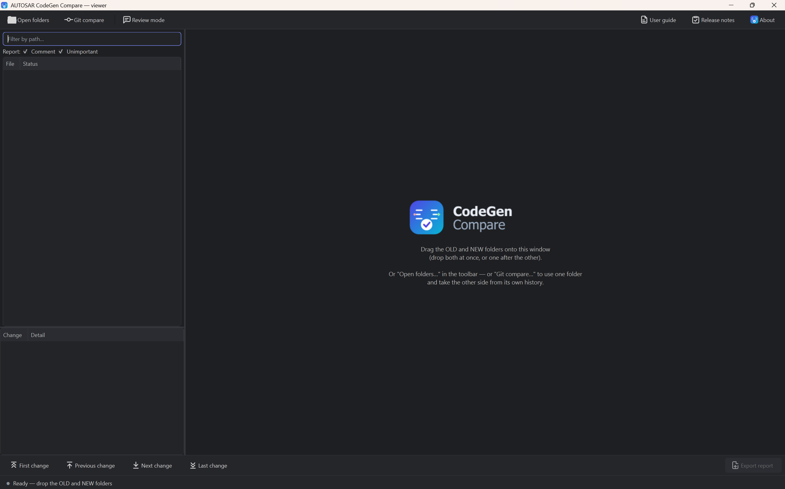
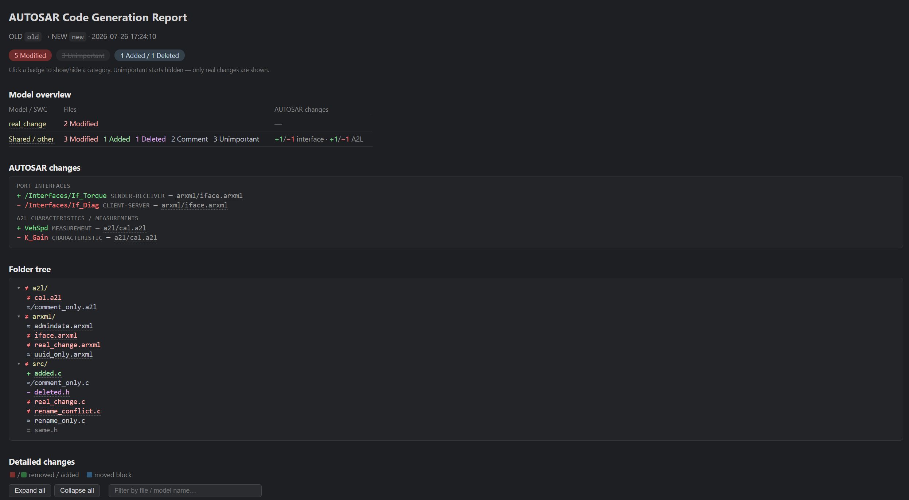

# CodeGen Compare Tool

[](https://github.com/longvo92/codegen-compare-tool/actions/workflows/test.yml)
[](https://www.python.org/downloads/)
[](LICENSE)
[](https://github.com/longvo92/codegen-compare-tool/releases/latest)

🇻🇳 **Tiếng Việt:** [README](docs/vi/README.md) · [Kiến trúc](docs/vi/architecture.md)

Diff two AUTOSAR code-generation output folders (MATLAB/Simulink Embedded Coder) and show **only the changes that matter**.

Regenerating a Simulink model rewrites timestamps, UUIDs, comment banners and auto-generated variable names even when the behaviour is identical. This tool classifies every hunk as *real* or *ignorable*, then gives you two ways to review the result: a self-contained **HTML report** with an AUTOSAR-level summary on top of the text diff, and a **side-by-side desktop viewer** with a change minimap.

Two front ends over one compare core, so a verdict never depends on how you look at it:

| | For | Runs when |
|---|---|---|
| [**Viewer**](#side-by-side-viewer) | reviewing interactively: folder tree, two-pane diff, minimap | no folders on the command line (or a double-clicked `.exe`) |
| [**CLI**](#command-line) | pipelines and scripts — writes the report, exit code gates the build | both folders named on the command line |

**Zero dependencies for the compare itself** — Python 3.8+ standard library only for the CLI and the HTML report: no pip install required, no server, no internet access. The [side-by-side viewer](#side-by-side-viewer) adds PySide6, imported only when it opens.

- [Install](#install)
- [Quick start](#quick-start)
- [Command line](#command-line)
- [Side-by-side viewer](#side-by-side-viewer)
- [What counts as noise](#what-counts-as-noise)
- [Moved block detection](#moved-block-detection)
- [AUTOSAR semantic summary](#autosar-semantic-summary)
- [Grouping by model / SWC](#grouping-by-model--swc)
- [HTML report](#html-report)
- [CI integration](#ci-integration)
- [Single-file build](#single-file-build)
- [Development](#development)

## Install

Run straight from a clone — nothing to install:

```bash
git clone https://github.com/longvo92/codegen-compare-tool.git
cd codegen-compare-tool
python -m compare_tool --help
```

Or install it as a command (`compare-tool`):

```bash
pip install git+https://github.com/longvo92/codegen-compare-tool.git
```

For machines where you cannot install anything, see [Single-file build](#single-file-build).

## Quick start

```bash
python -m compare_tool <old_gen_folder> <new_gen_folder> [--report out.html]
```

The scan writes a self-contained HTML report (default `compare_report.html`) that opens in any browser and can be shared as a single file.

Leave the folders out and the [side-by-side viewer](#side-by-side-viewer) opens instead — drop the two folders onto it:

```bash
python -m compare_tool
```

Exit codes:

| Code | Meaning |
|---|---|
| `0` | No real changes |
| `1` | Real changes found (useful as a CI gate) |
| `2` | **Compare INCOMPLETE** — some path could not be listed, read or compared (permissions, file locked by another process, long paths, …), or the report could not be written |

Exit `2` always shows: `!!` in the terminal, a red banner in the report. `--exit-zero` does not suppress it.

A report path that cannot be written (missing folder, file open in a browser,
read-only) is exit `2` with a one-line reason — never a traceback, and never
exit `1`, which a pipeline reads as the ordinary "real changes found". What the
scan did find is still printed.

## Command line

| Flag | Meaning |
|---|---|
| `--report out.html` | Report output path (default `compare_report.html`). An existing file there is deleted before the scan starts |
| `--exclude PATTERN` | Skip files matching a glob (relative path or bare file name), repeatable. Example: `--exclude compare_report.html` |
| `--exit-zero` | Always exit 0 even when real changes exist (report-only mode for pipelines). Compare errors still exit 2 |
| `--arxml-only` | Scan only `.arxml`/`.xml`/`.a2l` and write a compact per-type report (default `arxml_update.html`) — always written, even when nothing changed |
| `--review FILE` | Render notes and sign-offs from a review file (`codegen-review.json`, written by the viewer) next to the changes they belong to, plus a `Reviewed` badge that hides the changes already signed off. Must be named explicitly — a report must not pick up someone else's sign-off by accident; no effect with `--arxml-only` |
| `--theme dark\|light` | Colour scheme the report and the viewer open with (default `dark`). The report carries **both** and has its own switch, so this only sets what the reader sees first |
| `--qt`, `--viewer` | Open the side-by-side viewer on folders named on the command line, instead of comparing them in the terminal. Needs the `viewer` extra (see below) |

Omitting `old_dir`/`new_dir` opens the viewer. `--gui` (the tkinter panel) was removed in 1.1.0.

## Side-by-side viewer

Desktop app (PySide6): folder tree, two-pane diff with a minimap and syntax colouring, per-change review notes, and a commit picker when the folder is in a git checkout.

```bash
pip install "codegen-compare-tool[viewer]"   # or: pip install PySide6
python -m compare_tool                                        # then drop the folders in
python -m compare_tool --qt <old_gen_folder> <new_gen_folder> # or start loaded
```



Two ways in: `Open folders…` for two folders you name yourself, and `Git compare…` for **one** folder in a git checkout — it lists the commits that touched that folder, checks the one you pick out to a temp folder (read-only — your working copy is never touched), and compares as usual.

Reading a scan:

- The scan **opens on the first change** — the pane is never empty next to a tree full of results.
- `F8` / `F7` step through the changes in the open file and then **carry on into the next (previous) file** with something to review, wrapping at the end. `Ctrl+Home` / `Ctrl+End` stay inside the file.
- `Ctrl+F` **finds text in the open file** (either side, `F3` / `Shift+F3` to step, `Esc` to close). The query survives moving to another file, so an identifier can be chased across the compare.
- `Hide identical` leaves only the files with a difference in the tree. It is a view: verdicts, counts and the exported report are untouched.
- Unticking `Comment` / `Unimportant` **greys those lines out** rather than removing them: they stay where they are, keep their line numbers, lose their red/green, and drop off the minimap and out of `F7`/`F8`. The code around a change is what makes it readable, and a regenerated file is mostly banner churn — folding it away took most of the file with it.
- `☀ Light` / `☾ Dark` in the toolbar switches the colour scheme; `--theme` picks the one it starts in. C, ARXML and A2L are syntax-coloured in both.

`Review mode` adds the note box and a `Review` column in the tree — green when every change in a row is signed off, amber part way, grey when none is. Sign off one change (`Ctrl+R`) or a whole file (`Ctrl+Shift+R`); the notes travel into the exported report.

`Export report…` (`Ctrl+E`) writes the same self-contained HTML report the CLI writes, with the review notes folded in. It is always built from the **complete scan**, never from what is on screen — a category you collapsed in the tree still appears in the file with its real verdict.

Full walkthrough is built into the app — `Help` → `User guide` (`F1`), which works offline. Standalone `.exe` (no Python needed): see [Single-file build](#single-file-build).

## What counts as noise

| Kind | Rule | Files |
|---|---|---|
| `comment` | C comments (`//`, `/* */`), XML comments (`<!-- -->`) | .c .h .arxml .a2l |
| `rename` | Consistent 1-to-1 variable renaming (MATLAB auto-generated names). Anything the mapping can't fully explain stays a real change | .c .h |
| `uuid` | `UUID="..."` attributes | .arxml .xml |
| `timestamp` | `<ADMIN-DATA>` blocks, `<DATE>` | .arxml .xml |
| `sw-version` | `<SW-VERSION>` version stamps (bumped on every regenerate). Anchored, so `<SW-MAJOR-VERSION>` and the like are untouched | .arxml .xml |
| `whitespace` | Indentation, trailing spaces, blank lines | all |
| `line-endings` | CRLF vs LF, BOM | all |

Auto-generated name churn is recognised as a `rename`. Two identifiers count as the same name only when the code generator owns both — a generated prefix (`rtb_`, `rtu_`, `rty_`, `rtDW`, `rtP`, `rtC`, `rtZC`, `localB`, `localDW`, …), a DWork field (`_DSTATE`, `_PreviousInput`, `_MODE`, `_SubsysRanBC`, …), or an embedded block-path checksum (`Sub_c4nxjoom3d_step` → `Sub_j2kqp1wxab_step`) — **and** they share a root once the generated part is removed. The generated part is a mangling suffix (`_c`, `_o4`) or a checksum (`rtb_AND_c4nxjoom3d` → `rtb_AND_j2kqp1wxab`); renumbered MATLAB Coder temporaries (`tmp`, `idx`, `loop_ub`, `i`) are covered too.

A shorter name can stop an argument wrapping at 80 columns, so the two sides hold the same statements over a different number of lines. Such a hunk is compared as one token stream — where the newlines fell stops mattering, while token order still has to match exactly.

Everything else keeps its suffix as meaning. `SIG_TORQUE_MIN` → `SIG_TORQUE_MAX` and `CFG_TIMEOUT_MS` → `CFG_TIMEOUT_US` are real changes, and so are `rtb_AND_…` → `rtb_OR_…` (a different block drives that buffer) and `Sub_…_step` → `Sub_…_Init` (a different entry point). Digits glued to a block name (`rtb_Switch1` vs `rtb_Switch2`) are part of the name, not a mangle tail.

**Comment changes are their own category.** A file whose differences are *only* comments is reported as **Comment**, separate from **Unimportant** (UUIDs, timestamps, SW-VERSION, renames, whitespace) — a rewritten comment banner triages differently from a renamed identifier. Separate counts in the CLI summary and its own tree marker in the viewer. A file mixing comments *with* other noise stays Unimportant. The viewer has a rule toggle for each; the HTML report gives `Unimportant` a badge and leaves comment lines out altogether — see [HTML report](#html-report).

## Moved block detection

A block deleted in one place and reappearing intact elsewhere (Embedded Coder reorders functions and declarations when a model changes) is labelled `moved` and coloured **blue** instead of red/green. Still counts as **Modified** — reordering can change behaviour — it's just easier to see than two large red/green blocks.

Matching ignores generated-name churn, so a block that moved *and* had its checksums regenerated is still recognised as one move rather than an unrelated delete plus insert.

## AUTOSAR semantic summary

The tool extracts AUTOSAR information from both sides and reports changes at the **semantic** level, not just as text:

| Source | Extracted | Reported |
|---|---|---|
| `.arxml`/`.xml` | **Port interfaces** (SENDER-RECEIVER, CLIENT-SERVER, MODE-SWITCH, NV-DATA, PARAMETER, TRIGGER) with their full package path | added / removed |
| `.arxml`/`.xml` | **SWCs** (APPLICATION, SENSOR-ACTUATOR, SERVICE, CDD, ECU-ABSTRACTION, NV-BLOCK) | added / removed |
| `.arxml`/`.xml` | SWC **ports** (P/R/PR + referenced interface), **runnables** (+ SYMBOL), **events** (kind, PERIOD, triggered runnable) | added / removed / **changed** (e.g. a TIMING-EVENT period going `0.01s → 0.02s`, a port pointing at a different interface) |
| `.c` | **RTE access points** — every `Rte_Read/Write/Call/IrvRead/IrvWrite/Mode/Switch/…` call (comments stripped before counting) | added / removed |
| `.a2l` | **Calibration objects** — `CHARACTERISTIC` / `MEASUREMENT` by name (comments and strings stripped first, so commented-out blocks do not count) | added / removed |

How it is shown:

- **CLI**: `ARXML interfaces`, `AUTOSAR behavior`, `RTE access points` and `A2L objects` blocks listing `+`/`-`/`~` entries with the file each belongs to.
- **HTML report**: an **AUTOSAR changes** section at the top of the page, grouped by kind (port interfaces / software components / ports / runnables / events / RTE access points / A2L characteristics & measurements). Clicking a file name jumps to its detailed diff, and each file in Detailed changes carries its own `Interfaces:` / `Behavior:` / `RTE:` / `A2L:` note.
- Whole files added or deleted contribute every interface / SWC / RTE call / A2L object inside them as added or removed.

A file whose XML fails to parse is skipped from this summary (its text diff still shows in full). An unknown `Rte_` call isn't counted here but still appears in the diff.

## Grouping by model / SWC

Files are grouped by **Simulink model** using the Embedded Coder AUTOSAR naming convention (`X.c`, `X.h`, `X.arxml`, `Rte_X.h`, `X_data.c`, the modular ARXML set, …). Files that match no model land in a final **Shared / other** group.

## HTML report

Self-contained file, one per compare: badge toggles, folder tree, filter box, collapsible diffs per file. Opens `Unimportant` hidden, `Modified` expanded, so it opens on what matters. Clicking `Unimportant` reveals the actual noise lines — painted flat grey rather than red/green, so a revealed category still reads as "does not count" instead of looking like another change. Comment changes never render in the report at all — only a placeholder states how many comment lines were hidden — the report is a record meant to be sent around, and comment churn is left out of it entirely; the side-by-side viewer still shows them, greyed, for a reviewer working file by file. A `☀ Light` / `☾ Dark` button sits in the top right — both palettes are embedded in the file, so switching fetches nothing and works on a machine with no internet.

A whole file with nothing but comment differences still gets no detail section of its own (there is nothing beyond the comment lines to show); it keeps its own `≉` mark and `Comment` count in the folder tree either way.



## CI integration

Run as a pipeline gate — one command, meaningful exit codes:

```bash
python -m compare_tool old_dir new_dir --exit-zero --exclude compare_report.html
```

`--exit-zero` keeps the build green on regenerated code; `--exclude` keeps the previous run's report from counting as a diff. Publish `compare_report.html` as a build artifact.

See [azure-pipelines.yml](azure-pipelines.yml) for a working example (OLD checked out via `git worktree`, NEW is the working tree).

## Single-file build

```powershell
.\build.ps1           # dist\compare-tool.exe  - one file, nothing to install on the target
.\build.ps1 -Pyz      # also dist\compare_tool.pyz for machines that have Python 3.8+
.\build.ps1 -PyzOnly  # zipapp only (building it needs no PyInstaller / PySide6)
```

`dist\compare-tool.exe` is **one binary carrying both front ends**, and it wears the tool's own icon:

| Invocation | What happens |
|---|---|
| `compare-tool.exe <old> <new> [flags]` | CLI: scan, write the HTML report, exit `0`/`1`/`2` |
| `compare-tool.exe --qt <old> <new>` | side-by-side viewer, folders already loaded |
| double-click (no arguments) | side-by-side viewer, waiting for the two folders |

Built as a **console** application so terminal runs keep their exit code (`1` = real changes, `2` = compare incomplete) for the CI gate. The viewer hides the console window at runtime — you'll see a brief flash on double-click. A crash un-hides the console so the error is visible.

- **`.pyz` (zipapp, stdlib)**: `python compare_tool.pyz <old> <new> [flags]`. Prefer it when Python is available — tiny, no build dependencies, not flagged by antivirus. The CLI works anywhere; the viewer additionally needs PySide6 on that machine (without it, the tool says so instead of opening).
- **`.exe` (PyInstaller onefile, ~47 MB)**: no Python needed on the target. Building needs `pyinstaller` and `PySide6` on the dev machine (`build.ps1` installs them), and the binary only runs on the OS it was built on. PyInstaller executables are sometimes blocked by antivirus or AppLocker — fall back to the `.pyz` there.

Every CLI flag behaves identically in the packaged builds. `build/` and `dist/` are already in `.gitignore`.

## Development

```bash
python -m unittest discover -s tests
```

CI runs the suite on Linux and Windows against Python 3.8 and 3.11, plus a headless scan of the fixture tree checking both the report and the exit code.

```
compare_tool/
├── main.py          # entry point: picks the CLI or the viewer, run_compare() core
├── resources.py     # finds the shipped icons/logo, in a checkout and in the .exe
├── qtviewer/        # PySide6 side-by-side viewer (app, diff pane, minimap, dialogs)
├── scanner.py       # walks both trees, pairs files by relative path
├── diff_engine.py   # two-pass diff (raw + normalized), hunk classification, moved-block detection
├── c_rules.py       # C/H rules: strip comments, tokenize, detect renames, extract RTE access points
├── arxml_rules.py   # ARXML rules: UUID, ADMIN-DATA, DATE, comments + extract port interfaces, SWCs (ports/runnables/events)
├── a2l_rules.py     # A2L rules: strip C-style comments + extract CHARACTERISTIC/MEASUREMENT
├── view_model.py    # renderer-agnostic view model (paint mode, intra-line span, row alignment) shared by the report and the viewer
├── theme.py         # the dark and light palettes as named roles, shared by the report's CSS and every Qt surface
├── syntax.py        # line-at-a-time C / XML / A2L token spans, Qt-free so it ships in the .pyz
├── review.py        # reviewer notes and sign-offs, keyed by change content so they survive a rescan
├── gitsource.py     # read-only `git archive` of a commit into a temp folder, so a commit can be the OLD side
└── report.py        # self-contained HTML report (badge toggles, model overview, grouping, filter, collapsible diffs)
```

[docs/architecture.md](docs/architecture.md) covers how these fit together and why: the two diff passes, where a verdict is decided, the shared seams and the result-dict contract. Anything both renderers need lives in `view_model.py` (what changed) or `theme.py` (what colour it gets) — reimplementing a mapping inline lets the HTML report and the viewer drift apart.

To add a rule: write the strip function in `c_rules.py` / `arxml_rules.py` / `a2l_rules.py`, join it into that ruleset's shadow, register one labelled variant in `_build_variants` in `diff_engine.py`, and add both tests — the pattern alone is noise, and the same pattern *beside* a real change still reports the real change.

Issues and pull requests are welcome. Please keep the **compare core stdlib-only** — it has to run on locked-down build servers, so PySide6 stays confined to `compare_tool/qtviewer/` and is imported only when the viewer opens — and add a test under `tests/` for any new rule.

## Author

**Long Vo Thien**

## License

Released under the [MIT License](LICENSE) © 2026 Long Vo Thien.
