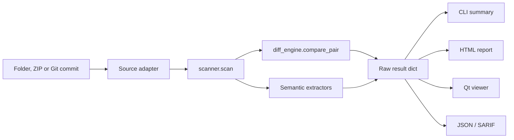

# Architecture

This is the implementation map for maintainers and code agents. Read [AGENTS.md](../AGENTS.md) first; it contains the project invariants and required checks. This file explains where behavior lives and which contracts must remain stable.

The English document is authoritative.

## Non-negotiable contracts

1. If a difference cannot be proven to be noise, it is a real change.
2. A scan, read or comparison failure produces `error`; it never looks identical.
3. File verdicts are `identical`, `comment-only`, `ignorable-only`, `real-change`, `added`, `deleted` or `error`.
4. Only `comment-only` and `ignorable-only` may be folded or muted.
5. CLI, report and viewer consume the same raw scan result.
6. The comparison core and zipapp use only the Python standard library and support Python 3.8.
7. Qt imports stay inside `compare_tool/qtviewer/` and are loaded lazily.
8. HTML reports are self-contained and make no network requests.
9. Exit codes are `0` for no real changes, `1` for real changes and `2` for incomplete comparison. `--exit-zero` never suppresses `2`.

## Data flow



Source adapters materialize inputs as directories. Everything after that uses the same scanner and result contract.

## Module map

| Module | Responsibility |
|---|---|
| `main.py` | CLI parsing, front-end selection, exit codes and terminal output |
| `scanner.py` | Tree walk, file comparison, move pairing and semantic rollups |
| `diff_engine.py` | Two-pass comparison, hunk classification and the single verdict decision |
| `linediff.py` | Patience-based line matching |
| `c_rules.py` | C/C++ comments, generated renames and safe reorder checks |
| `arxml_rules.py` | ARXML/XML noise rules and semantic extraction |
| `a2l_rules.py` | A2L noise rules and semantic extraction |
| `langspec.py` | Shared comment/string grammar and whitespace-safe shadows |
| `filepair.py` | Conservative Added/Deleted move pairing |
| `consistency.py` | Cross-file regeneration advisories |
| `view_model.py` | Renderer-neutral labels, row alignment and visual modes |
| `report.py` | Self-contained HTML and shared Overview data |
| `serialize.py` | JSON and SARIF output |
| `review.py` | Stable review IDs, notes and sign-offs |
| `gitsource.py` | Read-only Git snapshot materialization |
| `zipsource.py` | Safe ZIP extraction and wrapper-folder handling |
| `theme.py` | Named color roles for HTML and Qt |
| `resources.py` | Optional packaged UI resources |
| `qtviewer/` | The only Qt-dependent package |

## Comparison contract

`scanner.scan` returns a dict keyed by relative path. Each value has at least a verdict and comparison metadata:

```python
{
    "status": "real-change",
    "hunks": [
        {
            "kind": "real",
            "old_range": [12, 15],
            "new_range": [12, 14],
        }
    ],
    "renames": {},
    "notes": [],
    "binary": False,
}
```

Semantic keys such as `ifaces`, `swc`, `rte` and `a2l` are added only when applicable. Move pairs add `moved_from` or `moved_to`, `move_status` and `move_similarity`.

Ranges are zero-based and end-exclusive indexes into raw file lines. Do not convert the stored coordinates to shadow lines or rendered rows.

Hunk kinds currently include `real`, `moved`, `comment`, `rename`, `assumed-rename`, `reorder`, `uuid`, `timestamp`, `sw-version`, `description`, `whitespace` and `mixed`.

### Verdict ownership

`diff_engine._status_of` is the only place that decides a file verdict. `scanner.FOLDABLE` names the only foldable verdicts.

A UI filter may change paint, navigation or visibility. It must not rewrite `status`, counts or exported data. Reports and summaries must always use the raw result.

## Two-pass diff

`diff_engine.compare_pair` uses `linediff.hunks` for both passes so coordinates stay aligned.

1. **Truth pass:** compare normalized shadows. Comments and supported generator noise are removed while literal contents and significant Python/YAML indentation are preserved. Anything left is real.
2. **Display pass:** diff raw lines and label each hunk. A raw hunk that does not overlap a real hunk is classified by the one-rule variants. If several rules are needed, its kind is `mixed`.

The matcher uses patience anchors, then an exact matcher for remaining gaps. This avoids poor alignment in generated files with many repeated structural lines.

### Rename and reorder safety

A generated rename is applied only after a one-to-one mapping is inferred and rechecked against the shadow. Function callees require matching generated checksum roots. Literal contents are never rewritten.

A reorder is noise only when every line is a side-effect-free scalar assignment, both sides contain the same statements and all data dependencies keep their order. Calls, increments, nested assignments, control flow, declarations and indirect writes disqualify the block.

`--skip-var-renames` is the only intentionally unsafe comparison mode. Its hunks use `assumed-rename`, and every output surface must disclose that the option was used.

## Semantic extraction

`scanner.compare_file` attaches semantic data for real changes and one-sided files. The `summarize_*` functions aggregate interfaces, SWCs, RTE access and A2L objects.

`consistency.py` derives advisories from the complete result. Advisories never change verdicts or exit codes.

File move pairing runs after verdicts are settled. A pair is presentation metadata: Added and Deleted verdicts remain in the result and counts.

## Shared presentation seams

Keep facts shared by two front ends outside their renderers:

| Shared decision | Owner |
|---|---|
| Hunk kind to display mode | `view_model.mode_of` |
| Intra-line highlight span | `view_model.char_span` |
| Side-by-side row alignment and muting | `view_model.aligned_rows`, `mute_rows` |
| AUTOSAR display vocabulary | `view_model.SWC_DISPLAY` |
| Model Overview grouping and counts | `report.model_overview` |
| Function/object caption per line | `funcname.enclosing` |
| Color roles | `theme.py` |
| Review identity | `review.py` |

Do not copy mappings or rollup logic into CLI, HTML or Qt code.

## Front ends

### CLI and report

`main.viewer_requested` decides whether the process opens Qt or runs a terminal comparison.

`run_compare` removes a stale target report before scanning. A report-write failure preserves the scan for terminal output and exits `2`.

With `--no-report`, `run_compare` skips HTML rendering. `summary_lines(..., tree=True)` prints the Overview, full tree, semantic details and warnings without source hunks. `report.model_overview` supplies the same structured rows to HTML and terminal renderers.

### Viewer

The scanner runs in `qtviewer/worker.py` on a `QThread`. Results cross into widgets through signals. Renderer-independent Qt models must remain importable without PySide6 so headless tests still run.

Report export uses the raw scan, not the filtered tree. Muted noise remains part of the verdict and exported counts.

### Input adapters

`gitsource.py` uses `git archive` and never changes HEAD, the index or the working tree.

`zipsource.py` rejects unreadable/empty archives, prevents path traversal and removes temporary extraction directories after use.

## Change map

| Change | Start here | Required proof |
|---|---|---|
| Noise rule | Relevant `*_rules.py`, then `diff_engine.py` | Rule alone becomes noise; adjacent real change stays real |
| Generic comment language | `langspec.py`, `diff_engine.RULES`, `syntax.py` | String/comment boundaries agree in diff and highlighting |
| File verdict | `diff_engine._status_of` | Every renderer/count/exit path handles it; folding is explicit |
| Semantic object | Extractor, `scanner.compare_file`, `summarize_*` | Added, removed and modified cases |
| Shared label or rollup | `view_model.py` or a renderer-neutral report helper | HTML, terminal and Qt stay consistent |
| Color | `theme.py` | Role exists in both themes |
| CLI behavior | `main.py` | Exit codes, stale-output behavior and docs |
| Viewer behavior | `qtviewer/` | Headless model test plus a rendered check |
| JSON/SARIF schema | `serialize.py` | Schema/version compatibility and error representation |

## Verification

Run before commit:

```bash
python -m unittest discover -s tests -v
python -m ruff check .
```

For a release:

```bash
python packaging/release_check.py X.Y.Z
```

Qt tests may skip without PySide6. A green run in that environment does not verify the viewer.
