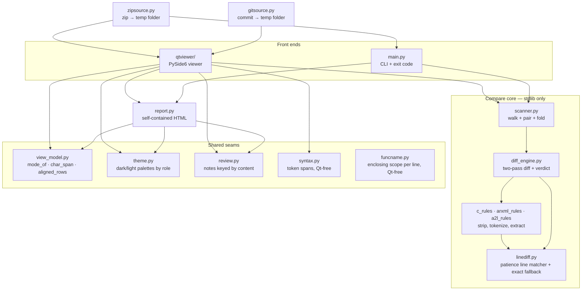
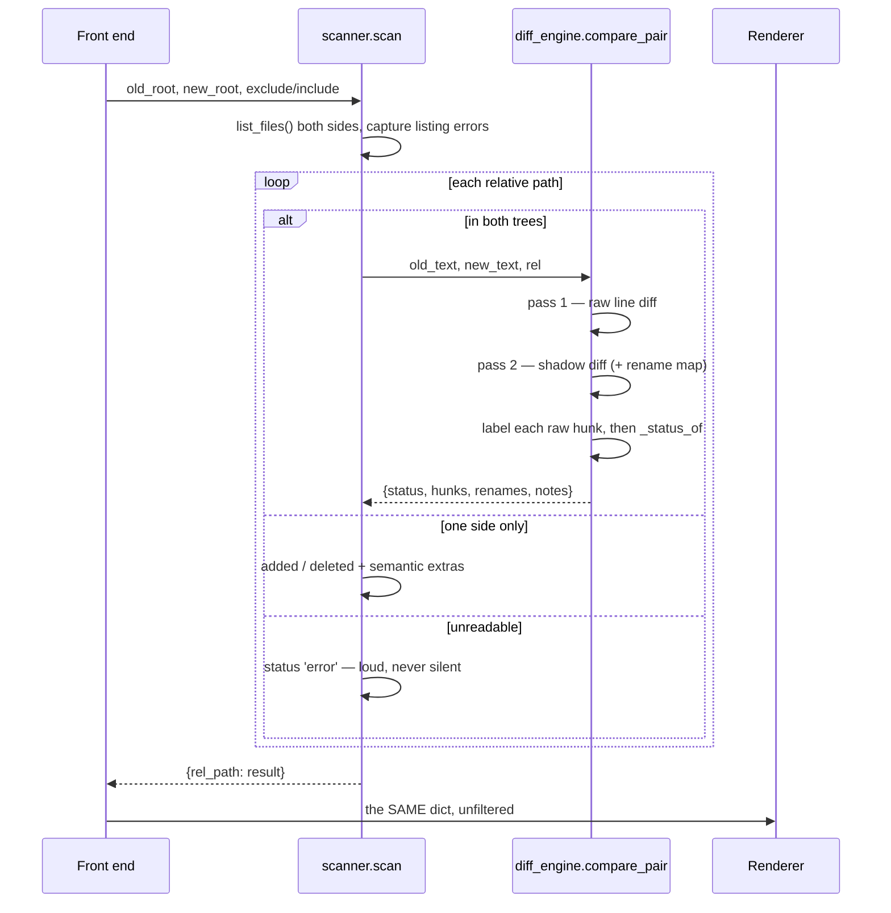

# Architecture

🇻🇳 Bản tiếng Việt: [vi/architecture.md](vi/architecture.md)

How the compare tool is put together, and why. For what it *does*, read the
[README](../README.md) first, and [usage.md](usage.md) for the flags, the noise
rules and the report's layout; this document is for someone about to change the
code.

## The claim the design has to protect

The product is one sentence: **"you can ignore what I hid."**

Regenerating a Simulink model rewrites timestamps, UUIDs, comment banners and
auto-generated identifiers even when the behaviour is identical. The tool
classifies every difference so a reviewer is not drowned in that churn. The
moment it hides one real change, a reviewer stops trusting the filter and the
tool is worse than `diff`.

Every structural decision below follows from that: **anything not *proven* to
be noise is a real change**, and anything that could not be compared at all is
louder still.

## Layers



Two rules hold this shape:

**The core imports nothing but the standard library.** `scanner`, `diff_engine`,
the three rule modules, `report`, `review`, `view_model`, `theme`, `syntax`,
`funcname`, `gitsource` and `zipsource` are what ships in `compare_tool.pyz` — no install, the
documented fallback for machines where antivirus blocks the `.exe`. One
third-party import in `scanner.py` and the zipapp stops running there. PySide6
lives only under `compare_tool/qtviewer/` and is imported lazily, when the
viewer opens, so the test suite runs headless.

**Arrows only point down.** The core never imports a front end. `syntax.py`
says *what* a stretch of text is and never what colour it gets — that is
`theme.py`'s job, answered once for both surfaces — so the Qt layer and any
second surface can reuse it without the mapping being written twice.

```
compare_tool/
├── main.py          # entry point: picks the CLI or the viewer, run_compare() core
├── resources.py     # finds the shipped icons/logo, in a checkout and in the .exe
├── qtviewer/        # PySide6 side-by-side viewer (app, diff pane, minimap, dialogs)
├── scanner.py       # walks both trees, pairs files by relative path
├── diff_engine.py   # two-pass diff (raw + normalized), hunk classification, moved-block detection
├── linediff.py      # the line matcher both passes share: patience anchoring, exact fallback
├── filepair.py      # matches an added file to the deleted one it was renamed/moved from
├── c_rules.py       # C/H rules: strip comments, tokenize, detect renames, extract RTE access points
├── arxml_rules.py   # ARXML rules: UUID, ADMIN-DATA, DATE, comments, DESC/LONG-NAME + extract port interfaces, SWCs (ports/runnables/events)
├── a2l_rules.py     # A2L rules: strip C-style comments + extract CHARACTERISTIC/MEASUREMENT
├── view_model.py    # renderer-agnostic view model (paint mode, intra-line span, row alignment) shared by the report and the viewer
├── theme.py         # the dark and light palettes as named roles, shared by the report's CSS and every Qt surface
├── langspec.py      # the comment/string grammar per language, shared by syntax.py (colouring) and the diff shadow (folding) so they agree; generic comment stripper for Python/YAML/JSON
├── syntax.py        # line-at-a-time C / C++ / XML / A2L / Python / JSON / YAML token spans, Qt-free so it ships in the .pyz
├── funcname.py      # enclosing scope name per line (C/C++ function / Python class·method / SHORT-NAME / A2L block), Qt-free — feeds hunk captions and the "Affected" list
├── review.py        # reviewer notes and sign-offs, keyed by change content so they survive a rescan
├── gitsource.py     # read-only `git archive` of a commit into a temp folder, so a commit can be the OLD side
├── zipsource.py     # read-only unpack of a .zip artifact into a temp folder, so a zip can be either side
└── report.py        # self-contained HTML report (badge toggles, Overview, grouping, filter, collapsible diffs)
```

## Data flow of one compare



### The two passes

`compare_pair` diffs the files twice. Both passes call the same matcher,
`linediff.hunks`, so they cannot align the same two files differently.

That matcher is **patience**, not `difflib` directly, and the reason is the
shadow: `arxml_shadow` blanks every UUID and ADMIN-DATA block, so a shadow's
structural lines are identical from one package to the next. `difflib`'s
`autojunk` heuristic refuses to anchor on any line making up more than 1% of a
long sequence — which, on that input, is every line. With no anchor left it
returns the whole file as one changed block, and because pass 2 is what decides
`real-change`, all the surrounding churn gets absorbed into a real hunk and
stops being foldable. Patience anchors only on lines occurring exactly once on
both sides and recurses into the gaps, so segments are small enough to hand the
leftovers to the exact (`autojunk=False`) matcher. See `linediff.py` — it also
records the measurements, because the fast path the heuristic was bought with
turns out not to be needed.

- **Pass 2 decides the truth.** Each side is reduced to a *shadow*: comments
  stripped, whitespace collapsed, UUIDs and dates and version stamps removed,
  and for C a verified 1-to-1 rename map applied. Whatever still differs
  between the two shadows is a real change. The rename map is best-effort and
  then *checked* — it is applied to the old shadow and re-diffed, and any line
  it does not fully explain stays real.
- **Pass 1 decides what you see.** The raw line diff keeps every textual
  difference, so the viewer can show the churn instead of pretending the files
  were identical. A raw hunk that intersects no real hunk is ignorable, and is
  *labelled* by `_build_variants`: a list of shadows each with exactly **one**
  rule applied. The first variant under which the hunk's two slices are equal
  names it (`comment`, `uuid`, `timestamp`, `sw-version`, `description`,
  `rename`, `whitespace`). A hunk that no single rule explains is `mixed` — still
  ignorable, but honest that more than one rule combined to explain it.

This is why the noise-rule checklist is what it is: a new rule has to be
text-based and preserve line count (or the two passes stop lining up), joined
into the ruleset's shadow, *and* given a labelled variant. Miss the variant and
the rule silently becomes `mixed`.

### The verdict lives in one function

`diff_engine._status_of` is the only place a status is decided:

| Status | Meaning | Foldable |
|---|---|---|
| `identical` | no difference at all | — |
| `comment-only` | every labelled hunk is `comment` | yes |
| `ignorable-only` | noise, but not comments alone | yes |
| `real-change` | at least one hunk survived pass 2 | **no** |
| `added` / `deleted` | present on one side only | **no** |
| `error` | could not be listed, read or compared | **no** |

`comment-only` is deliberately separate from `ignorable-only`: "the banner
moved" triages differently from "an identifier was renamed". A file mixing
comments *with* other noise stays `ignorable-only` — the narrower claim has to
be exact.

`scanner.FOLDABLE` names the only two statuses a UI toggle may collapse. Real
changes, one-sided files and errors are absent from that tuple **by
construction**, so no caller mistake can hide one.

### Folding is a pure function, not a rescan

`scanner.apply_fold` re-judges an already scanned tree under different rules
with no disk access: the hunks already say what kind each difference is, so
re-reading every file to learn the same thing is pure waste. It copies rather
than mutates, so the rules can be toggled back and forth. The viewer keeps the
untouched scan in `MainWindow._raw_results` and folds into `self.results` for
display.

Folding a category changes two things, and only these two: the file's
**verdict** (it comes back `identical`, or `real-change` if something real
remains) and how its rows are **painted** — `view_model.mute_rows` greys them,
the minimap stops striping them and `F7`/`F8` stop landing on them. The lines
themselves stay on screen. The hunks are never touched, so the exported report,
built from `_raw_results`, cannot notice that a category was folded.

Navigation follows what is on screen, not what is reviewable. A shown (unfolded)
comment or Unimportant hunk **is** an `F7`/`F8` stop, and a file whose whole
verdict is `comment-only` / `ignorable-only` is in `MainWindow._NAV_STATUS`, so
the walk crosses into it. Both fall out again the moment the category is folded,
because `apply_fold` has by then re-judged that file `identical` — one source of
truth, no second flag to keep in step with the checkboxes. What navigation must
never do is imply a sign-off: `DiffPane._stop_units` carries `None` for those
stops, so `current_unit()` reports nothing to review there. Only `real` and
`moved` are reviewable (`review.REVIEWABLE`), navigable or not.

## The result dict is the contract

Everything downstream — CLI summary, HTML report, viewer tree, review store —
consumes one dict per compared path:

```python
{
    'status': 'real-change',
    'hunks': [{'kind': 'real', 'old_range': [12, 15], 'new_range': [12, 14]},
              {'kind': 'moved', 'old_range': [40, 60], 'new_range': [40, 40],
               'moved_to': 91}],
    'renames': {'rtb_AND_c4nxjoom3d': 'rtb_AND_j2kqp1wxab'},
    'notes': ['line-endings'],
    'binary': False,
    # semantic extras, only on real changes and one-sided files:
    'ifaces': ..., 'swc': ..., 'rte': ..., 'a2l': ...,
    # only on a file paired across a rename/move (see below):
    'moved_from': 'swc_a/Sub.c',   # on the ADDED entry
    'moved_to': 'swc_b/Sub.c',     # on the DELETED entry
    'move_status': 'real-change', 'move_similarity': 0.89,
}
```

Ranges are 0-based, end-exclusive, into the **raw** lines of each side.
`kind` is one of `real`, `moved`, `comment`, `rename`, `uuid`, `timestamp`,
`sw-version`, `description`, `whitespace`, `mixed`.

The semantic extras are computed only where they can matter: a shadow-equal
file has the same content, so it cannot have moved the AUTOSAR surface.

### Renames and moves

`scanner` pairs files by relative path, which is right until the path is what
changed. After every verdict is settled, `_link_moves` takes the files that
came out `added` and `deleted` and asks `filepair` which of them are the same
file — exact content first, then similarity over the **shadow** lines, so a
file that moved *and* was regenerated still matches.

A pair is a **reading aid, not a verdict**. Both files keep their `added` /
`deleted` status, both stay in the counts, and the exit code does not move: a
file that changed folder is a change to the tree, and a pipeline gating on that
must keep seeing it. What the pair adds is `hunks` on the added entry —
describing it against the file it came from — so the report renders one diff
instead of two whole files, and the deleted entry points at it rather than
printing the same bytes again.

Because a pairing is a claim that can be wrong, it is only made when it is not
a guess: same extension, mutual best match, and a margin over the runner-up.
Generated files share banners and call shapes, so near-ties between unrelated
SWCs are the normal case rather than a freak one. An unmatched file simply
reports as it did before.

## Shared seams

Any fact two renderers need lives in one module they both import. The failure
mode this prevents is quiet: two copies of a four-line mapping agree perfectly
until someone adds a new kind to one of them.

- **`view_model.mode_of`** — hunk kind → paint mode (`real`, `moved`,
  `comment`, `minor`). The HTML report and the Qt panes cannot disagree about
  how a kind is coloured or whether it can be hidden.
- **`view_model.char_span`** — the intra-line highlight as plain character
  offsets, grown outward to the enclosing identifier so a rename marks the
  whole name rather than the letters that happen to differ. The report wraps
  them in a `<span>`; the viewer applies a `QTextCharFormat` over the same
  numbers — widening the span was one edit here, and both surfaces got it.
- **`view_model.aligned_rows` / `mute_rows`** — whole-file two-pane alignment,
  and playing a switched-off noise category *down* rather than away: the rows
  keep their place, their line numbers and their text, and come back with mode
  `muted` for the renderer to paint flat grey. Muting moves no row, so
  navigation stops and find hits stay valid without translation, and the
  reviewer keeps the context the surviving hunks have to be read in.
- **`theme.py`** — every colour as a named role, one value per theme. The
  report emits the whole palette as CSS custom properties and uses
  `var(--role)`; the Qt widgets look the same role up with `theme.c`. Adding a
  role means adding it to **both** palettes — an import-time assert says so,
  because the alternative is a `KeyError` on whichever surface nobody opened.
- **`review.py`** — notes and sign-offs keyed by a hash of the change's own
  text, not by line number, so an unrelated edit elsewhere in the file does not
  detach them on the next scan.
- **`funcname.enclosing`** — the scope name for each line (C/C++ function,
  Python class/method, AUTOSAR SHORT-NAME, A2L block), one list the report and
  the viewer both read. The
  report captions each hunk group and lists a file's `Affected` functions from
  it; the viewer tracks a "current function" as the pane scrolls. It never
  decides a verdict — a wrong name costs a caption, so the heuristics say
  `None` rather than guess.

## Front ends

`main.viewer_requested(argv)` owns the "which front end does this argv want"
decision, and answers it **without running the compare** — the frozen entry
point calls it to hide the console window before Qt starts. The rule: the
terminal compare runs only when both folders are named on the command line;
everything else opens the viewer.

### CLI

`run_compare` deletes any leftover report *before* scanning — if this run dies,
a stale file from the previous one must not pass for its result. A report path
that cannot be written raises `ReportWriteError` carrying the scan it could not
write, so the terminal still prints what was found, and the run exits `2`:

| Code | Meaning |
|---|---|
| 0 | No real change |
| 1 | Real changes found (the CI gate) |
| 2 | Compare INCOMPLETE — a path could not be listed, read or compared, or the report could not be written |

The exit code is a contract with somebody's pipeline. `--exit-zero` suppresses
`1`, never `2` — an incomplete compare must never look green.

### Viewer

The scan walks the disk, so it runs on a `QThread` (`qtviewer/worker.py`) and
results cross back through signals only. Widgets stay dumb: they walk a model
and paint it. `tree.py`, `summary_model.py` and `compare_tool/resources.py`
have no PySide6 import at all, so their tests run on a box with no Qt.

`Git compare…` is not a second compare mode. `gitsource.py` runs `git archive`
— read-only, touching neither HEAD, the index nor the working tree — to lay one
commit down in a temp folder, and everything downstream sees two directories as
usual. That matters because the folder being reviewed is normally the one the
engineer is still editing.

A dropped or picked `.zip` is the same idea one more time: `zipsource.py`
unpacks it read-only into a temp folder — guarding against a path that escapes
the destination, and descending into a lone wrapper directory so an Azure
`drop.zip` does not read as one directory deep — and the compare runs on the
folder, none the wiser. A source that materialises a temp folder labels its
pane by the commit or the zip name, since the temp path names nothing:
`diffpane.set_old_label` / `set_new_label`, one per side.

## Decisions worth knowing before you change something

**The record is never the filtered view.** `MainWindow._export_report` builds
from `_raw_results`, not from what is on screen. A category the reviewer
collapsed must still appear in the exported file with its real verdict —
otherwise an export could show a file as Identical when it is not. Same for the
quick-changes rollup.

**The HTML report is self-contained.** CSS and JS inline, no CDN, nothing
fetched when the file is opened. It gets mailed around and opened on machines
with no internet; a report that renders blank there is worse than no report.
That is also why the page carries *both* palettes rather than the one
`--theme` asked for: the reader's dark/light button has to be an attribute
flip, with nothing left to download.

**Cosmetic failures degrade, the compare does not.** A missing icon leaves a
button with its text label (`resources.py` getters return `None` and callers
cope); no PySide6 gives a plain sentence about the `viewer` extra, not a
traceback; Windows legacy codepages are handled with
`stream.reconfigure(errors='replace')` so a print can never kill a run. The
compare itself is the exception — a scan or render failure is loud, never an
empty, clean-looking result.

**The `.exe` is a console build on purpose.** A windowed build makes the shell
stop waiting and throws the exit code away, which breaks the CI gate. So the
console *window* is hidden at runtime instead (`packaging/entry.py`), and
un-hidden on a crash.

**Python 3.8 is a shipped promise.** No `match`, no `X | Y` at runtime;
`list[str]` in an annotation needs `from __future__ import annotations`. CI runs
3.8 and 3.11 on Linux and Windows, so a 3.10-ism passes locally and fails there.

## Where to change what

| Change | Touch |
|---|---|
| New noise rule | the rule module's strip function → that ruleset's shadow → one labelled variant in `_build_variants` → two tests (alone it is noise; beside a real change it stays real) |
| New file type (AUTOSAR-grade, with its own strips) | `RULES` in `diff_engine.py`, a `*_rules.py` module, shadow + variants |
| New file type (comment-only, e.g. Python/YAML) | one `LangSpec` in `langspec.py` (the comment/string grammar), add the ext to `RULES` and the ruleset to `_GENERIC_COMMENT_RULES`, one `_Lang` in `syntax.py` for its colours — the shadow, the variant and the colouring all read the one spec |
| New semantic extraction | `*_rules.py` extractor, wire into `scanner.compare_file` and `_single_info`, then a `summarize_*` rollup |
| Anything both renderers show | `view_model.py` — never inline in one of them |
| A colour, anywhere | `theme.py`, as a role in **both** palettes; the report uses `var(--role)`, Qt uses `theme.c(role)` |
| New verdict | `diff_engine._status_of`, and decide explicitly whether it belongs in `scanner.FOLDABLE` (default: no) |
| Viewer layout or colour | render it and look at it (`widget.grab().save(png)` under `QT_QPA_PLATFORM=offscreen`), then a real window |
