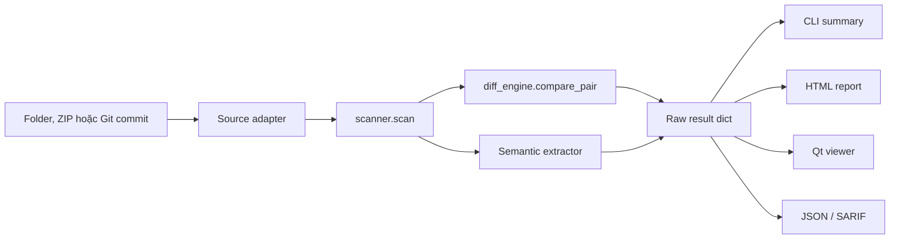

# Kiến trúc

Đây là bản đồ implementation dành cho maintainer. AI/code agent phải dùng [bản tiếng Anh](../architecture.md) làm nguồn chuẩn và đọc [AGENTS.md](../../AGENTS.md) trước khi sửa code.

## Contract bắt buộc

1. Nếu không chứng minh được khác biệt là noise, đó là real change.
2. Lỗi scan, đọc hoặc compare tạo verdict `error`; không được trông giống identical.
3. File verdict gồm `identical`, `comment-only`, `ignorable-only`, `real-change`, `added`, `deleted` và `error`.
4. Chỉ `comment-only` và `ignorable-only` được fold hoặc mute.
5. CLI, report và viewer dùng cùng raw scan result.
6. Comparison core và zipapp chỉ dùng Python standard library, hỗ trợ Python 3.8.
7. Qt import chỉ nằm trong `compare_tool/qtviewer/` và được load lazy.
8. HTML report độc lập, không gọi network.
9. Exit code: `0` không có real change, `1` có real change, `2` comparison không đầy đủ. `--exit-zero` không được bỏ qua `2`.

## Data flow



Source adapter đưa input về dạng directory. Từ scanner trở đi, mọi front end dùng chung result contract.

## Bản đồ module

| Module | Trách nhiệm |
|---|---|
| `main.py` | CLI parsing, chọn front end, exit code và terminal output |
| `scanner.py` | Scan tree, compare file, ghép file move và semantic rollup |
| `diff_engine.py` | Two-pass diff, phân loại hunk và quyết định verdict |
| `linediff.py` | Patience-based line matching |
| `c_rules.py` | C/C++ comment, generated rename và safe reorder |
| `arxml_rules.py` | ARXML/XML noise rules và semantic extraction |
| `a2l_rules.py` | A2L noise rules và semantic extraction |
| `langspec.py` | Comment/string grammar và whitespace-safe shadow |
| `filepair.py` | Ghép Added/Deleted thành file move một cách bảo thủ |
| `consistency.py` | Cross-file regeneration advisory |
| `view_model.py` | Label, aligned row và visual mode dùng chung |
| `report.py` | HTML độc lập và dữ liệu Overview dùng chung |
| `serialize.py` | JSON và SARIF |
| `review.py` | Stable review ID, note và sign-off |
| `gitsource.py` | Tạo Git snapshot read-only |
| `zipsource.py` | Giải nén ZIP an toàn |
| `theme.py` | Named color role cho HTML và Qt |
| `qtviewer/` | Package duy nhất phụ thuộc Qt |

## Result contract

`scanner.scan` trả về dict theo relative path:

```python
{
    "status": "real-change",
    "hunks": [
        {
            "kind": "real",
            "old_range": [12, 15],
            "new_range": [12, 14],
        }
    ],
    "renames": {},
    "notes": [],
    "binary": False,
}
```

Các key `ifaces`, `swc`, `rte` và `a2l` chỉ xuất hiện khi phù hợp. File move có thêm `moved_from` hoặc `moved_to`, `move_status` và `move_similarity`.

Range dùng index zero-based, end-exclusive trên raw line. Không đổi chúng sang shadow line hoặc rendered row.

`diff_engine._status_of` là nơi duy nhất quyết định file verdict. `scanner.FOLDABLE` khai báo hai verdict được phép fold.

UI filter chỉ được thay đổi paint, navigation hoặc visibility. Không được sửa `status`, count hoặc exported data.

## Two-pass diff

`diff_engine.compare_pair` gọi `linediff.hunks` cho cả hai pass để giữ alignment:

1. **Truth pass:** compare normalized shadow. Phần còn khác sau khi bỏ supported generator noise là real.
2. **Display pass:** diff raw line và gắn kind cho từng hunk. Hunk không overlap real hunk được phân loại bằng single-rule variant; nếu cần nhiều rule thì dùng `mixed`.

Shadow phải giữ nguyên literal content và indentation có ý nghĩa trong Python/YAML.

Generated rename chỉ được áp dụng sau khi mapping một-một được suy ra và verify lại. Function callee cần cùng generated checksum root. Literal không được rewrite.

Reorder chỉ là noise khi toàn bộ line là scalar assignment không side effect, hai phía có cùng statement và mọi data dependency giữ nguyên thứ tự.

`--skip-var-renames` là mode cố ý không an toàn duy nhất. Hunk của nó dùng `assumed-rename`, và mọi output phải báo option này đã được bật.

## Semantic và file move

`scanner.compare_file` gắn semantic data cho real change và one-sided file. Các hàm `summarize_*` tổng hợp interface, SWC, RTE access và A2L object.

`consistency.py` tạo advisory từ toàn bộ result. Advisory không đổi verdict hoặc exit code.

File move được ghép sau khi verdict đã chốt. Pairing chỉ là presentation metadata; Added và Deleted vẫn giữ nguyên trong count và exit code.

## Seam dùng chung

| Quyết định dùng chung | Owner |
|---|---|
| Hunk kind → display mode | `view_model.mode_of` |
| Intra-line highlight | `view_model.char_span` |
| Aligned row và muting | `view_model.aligned_rows`, `mute_rows` |
| AUTOSAR display vocabulary | `view_model.SWC_DISPLAY` |
| Model Overview | `report.model_overview` |
| Function/object caption | `funcname.enclosing` |
| Color role | `theme.py` |
| Review identity | `review.py` |

Không copy mapping hoặc rollup logic vào CLI, HTML hay Qt renderer.

## Front end và input

`main.viewer_requested` chọn Qt hoặc terminal comparison. `run_compare` xóa stale report trước khi scan; lỗi ghi report vẫn in được scan result và trả exit code `2`.

Với `--no-report`, tool bỏ qua HTML rendering. `summary_lines(..., tree=True)` in Overview, full tree, semantic details và warnings. `report.model_overview` cấp cùng structured rows cho HTML và terminal.

Viewer chạy scanner trong `qtviewer/worker.py` bằng `QThread`. Export report luôn dùng raw scan, không dùng filtered tree.

`gitsource.py` dùng `git archive`, không đổi HEAD, index hoặc working tree. `zipsource.py` chặn path traversal, báo lỗi archive hỏng/rỗng và xóa temp directory sau khi chạy.

## Sửa gì, bắt đầu ở đâu

| Change | Bắt đầu | Bằng chứng cần có |
|---|---|---|
| Noise rule | `*_rules.py`, rồi `diff_engine.py` | Rule đứng một mình là noise; cạnh real change vẫn là real |
| Generic comment language | `langspec.py`, `RULES`, `syntax.py` | Diff và highlighting hiểu comment/string giống nhau |
| File verdict | `diff_engine._status_of` | Mọi renderer, count và exit path xử lý rõ ràng |
| Semantic object | Extractor, `scanner.compare_file`, `summarize_*` | Added, removed và modified cases |
| Shared label/rollup | `view_model.py` hoặc renderer-neutral helper | HTML, terminal và Qt cho cùng kết quả |
| Color | `theme.py` | Role có trong cả hai theme |
| CLI behavior | `main.py` | Exit code, stale output và docs |
| Viewer behavior | `qtviewer/` | Headless model test và rendered check |
| JSON/SARIF schema | `serialize.py` | Schema compatibility và error representation |

## Verify

```bash
python -m unittest discover -s tests -v
python -m ruff check .
```

Trước release:

```bash
python packaging/release_check.py X.Y.Z
```

Qt tests có thể skip nếu thiếu PySide6.
