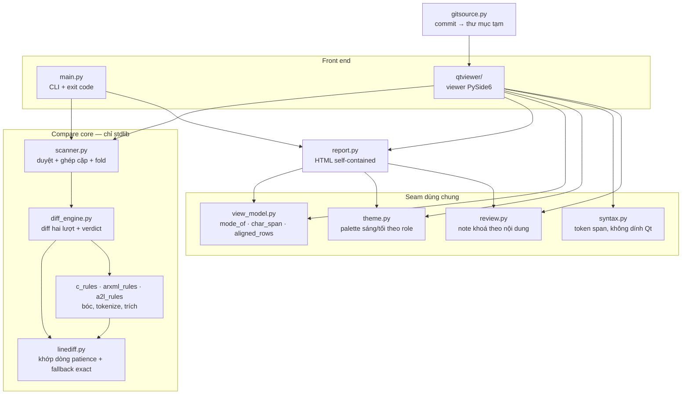
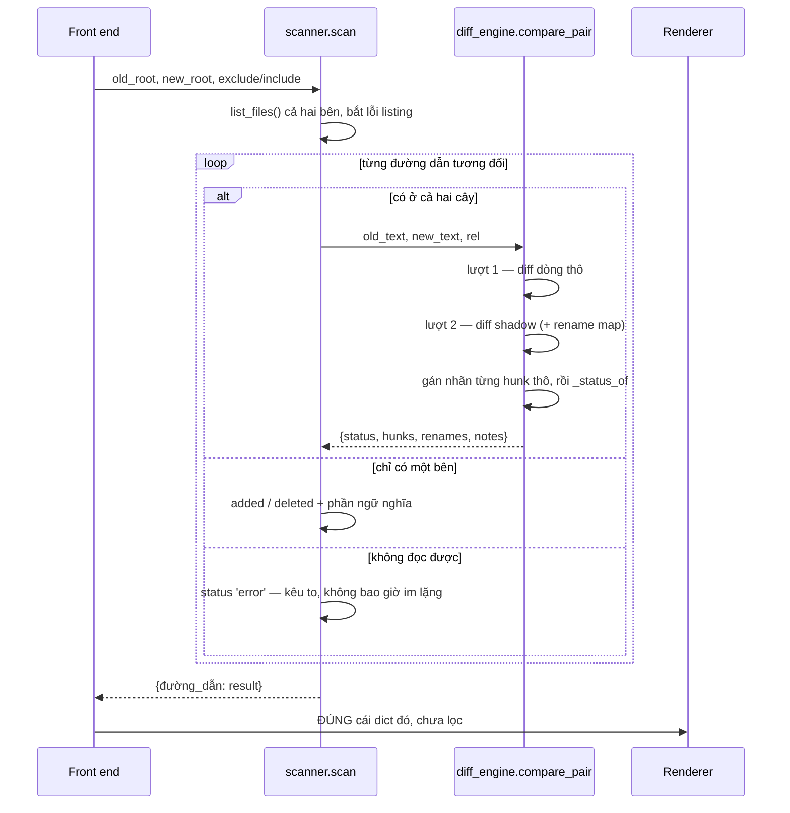

# Kiến trúc

> Bản tiếng Việt của [docs/architecture.md](../architecture.md). Bản tiếng Anh là
> bản chuẩn — khi hai bên lệch nhau, tin bản tiếng Anh.

Tool được ghép lại như thế nào, và tại sao lại thế. Muốn biết nó *làm gì* thì đọc
[README](README.md) trước, và [usage.md](usage.md) cho flag, luật noise và bố cục
report; tài liệu này viết cho người sắp sửa code.

## Lời hứa mà thiết kế phải bảo vệ

Sản phẩm gói trong một câu: **"cái gì tôi giấu đi thì anh bỏ qua được."**

Mỗi lần regenerate một model Simulink, timestamp, UUID, comment banner và tên
identifier auto-generated bị ghi lại dù hành vi không đổi. Tool phân loại từng khác
biệt để reviewer không chết chìm trong đống rác đó. Ngay khi nó giấu nhầm một thay
đổi thật, reviewer hết tin bộ lọc, và tool còn tệ hơn `diff`.

Mọi quyết định cấu trúc bên dưới đều đi ra từ đó: **cái gì không *chứng minh được*
là noise thì là thay đổi thật**, còn cái gì không so sánh được thì phải kêu to hơn
nữa.

## Phân lớp



Hai luật giữ cho hình dạng này đứng vững:

**Core không import gì ngoài standard library.** `scanner`, `diff_engine`, ba module
rule, `report`, `review`, `view_model`, `theme`, `syntax` và `gitsource` là những gì ship
trong `compare_tool.pyz` — không cần cài, và là phương án dự phòng đã được
ghi rõ cho các máy bị antivirus chặn `.exe`. Chỉ cần một import thư viện ngoài trong
`scanner.py` là zipapp hết chạy ở đó. PySide6 chỉ nằm dưới `compare_tool/qtviewer/`
và được import lười, lúc viewer mở, nên bộ test chạy headless được.

**Mũi tên chỉ đi xuống.** Core không bao giờ import front end. `syntax.py` nói một
đoạn text *là gì* chứ không nói nó tô màu gì — màu là việc của `theme.py`, trả lời
một lần cho cả hai surface — nên lớp Qt và bất kỳ surface thứ hai nào cũng dùng lại
được mà không phải viết mapping đó hai lần.

## Luồng dữ liệu của một lần compare



### Hai lượt diff

`compare_pair` diff hai file hai lần. Cả hai lượt đều gọi chung một matcher,
`linediff.hunks`, nên không thể căn cùng hai file theo hai kiểu khác nhau.

Matcher đó là **patience**, không phải `difflib` trực tiếp, và lý do nằm ở
shadow: `arxml_shadow` xoá ruột mọi UUID và khối ADMIN-DATA, nên các dòng cấu
trúc của shadow giống hệt nhau từ package này sang package khác. Heuristic
`autojunk` của `difflib` từ chối neo vào bất kỳ dòng nào chiếm hơn 1% của một
chuỗi dài — mà với input đó thì là *mọi* dòng. Không còn neo nào, nó trả về cả
file như một khối thay đổi duy nhất; và vì lượt 2 mới là cái quyết định
`real-change`, toàn bộ churn xung quanh bị nuốt vào một hunk real và mất khả
năng fold. Patience chỉ neo vào dòng xuất hiện đúng một lần ở cả hai bên rồi đệ
quy vào khoảng giữa, nên các đoạn còn lại đủ nhỏ để giao cho matcher chính xác
(`autojunk=False`). Xem `linediff.py` — số đo nằm ngay trong đó, vì hoá ra cái
đường nhanh mà heuristic kia đánh đổi để có được là không cần thiết.

- **Lượt 2 quyết định sự thật.** Mỗi bên được rút gọn thành một *shadow*: bóc
  comment, gộp whitespace, bỏ UUID, ngày tháng, version stamp, và với C thì áp một
  rename map đã được kiểm chứng. Cái gì còn khác nhau giữa hai shadow là thay đổi
  thật. Rename map chỉ là best-effort rồi *bị kiểm lại* — nó được áp lên shadow cũ
  và diff lại, dòng nào nó không giải thích trọn vẹn thì vẫn là real.
- **Lượt 1 quyết định cái bạn nhìn thấy.** Diff dòng thô giữ lại mọi khác biệt về
  text, nhờ vậy viewer hiện được đống rác thay vì giả vờ hai file y hệt nhau. Hunk
  thô nào không giao với hunk real nào thì là ignorable, và được *gán nhãn* bởi
  `_build_variants`: một danh sách shadow, mỗi cái áp đúng **một** rule. Variant đầu
  tiên mà hai lát cắt của hunk bằng nhau sẽ đặt tên cho nó (`comment`, `uuid`,
  `timestamp`, `sw-version`, `description`, `rename`, `whitespace`). Hunk mà không rule đơn lẻ nào
  giải thích được thì là `mixed` — vẫn ignorable, nhưng nói thẳng là phải nhiều rule
  cộng lại mới giải thích nổi.

Đây là lý do checklist khi thêm noise rule đúng như nó đang có: rule mới phải làm
trên text và giữ nguyên số dòng (không thì hai lượt lệch nhau), phải nối vào shadow
của ruleset, *và* phải có một variant có nhãn. Quên variant là rule đó âm thầm biến
thành `mixed`.

### Verdict nằm trong đúng một hàm

`diff_engine._status_of` là chỗ duy nhất status được quyết định:

| Status | Nghĩa | Fold được |
|---|---|---|
| `identical` | không khác gì cả | — |
| `comment-only` | mọi hunk có nhãn đều là `comment` | có |
| `ignorable-only` | noise, nhưng không phải chỉ mỗi comment | có |
| `real-change` | ít nhất một hunk sống sót qua lượt 2 | **không** |
| `added` / `deleted` | chỉ có ở một bên | **không** |
| `error` | không list / đọc / so sánh được | **không** |

`comment-only` cố ý tách khỏi `ignorable-only`: "cái banner dịch chỗ" triage khác
"một identifier bị đổi tên". File trộn comment *với* noise loại khác thì vẫn là
`ignorable-only` — lời khẳng định hẹp hơn thì phải chính xác.

`scanner.FOLDABLE` liệt kê đúng hai status mà một toggle UI được phép thu gọn. Thay
đổi thật, file một bên và lỗi vắng mặt khỏi tuple đó **do cấu trúc**, nên không lỗi
lập trình nào ở phía caller giấu được chúng.

### Fold là hàm thuần, không phải scan lại

`scanner.apply_fold` phán lại một cây đã scan theo bộ luật khác mà không đụng đĩa:
hunk đã nói sẵn mỗi khác biệt thuộc loại gì, nên đọc lại toàn bộ file để biết đúng
cái đó là phí công. Nó copy chứ không sửa tại chỗ, nên bật tắt luật qua lại thoải
mái. Viewer giữ nguyên lần scan gốc trong `MainWindow._raw_results` và fold vào
`self.results` để hiển thị.

Fold một nhóm chỉ đổi đúng hai thứ: **verdict** của file (thành `identical`, hoặc
`real-change` nếu còn thay đổi thật) và cách các dòng đó được **tô** —
`view_model.mute_rows` làm chúng xám đi, minimap thôi kẻ vạch cho chúng, còn
`F7`/`F8` thôi dừng ở đó. Bản thân các dòng vẫn nằm trên màn hình. Hunk
không bị đụng tới, nên report xuất ra từ `_raw_results` không thể biết là có nhóm
nào đã bị fold.

Navigation đi theo cái đang hiện trên màn hình, không phải cái review được. Hunk
comment hoặc Unimportant đang hiện (chưa fold) **là** một điểm dừng `F7`/`F8`, và
file mà verdict cả file là `comment-only` / `ignorable-only` thì nằm trong
`MainWindow._NAV_STATUS` nên lộ trình đi vào file đó. Cả hai rơi ra ngay khi
nhóm bị fold, vì lúc đó `apply_fold` đã xử lại file thành `identical` — một nguồn
sự thật duy nhất, không phải giữ thêm cờ nào đồng bộ với checkbox. Cái mà
navigation tuyệt đối không được làm là ngụ ý đã ký duyệt:
`DiffPane._stop_units` mang `None` cho các stop đó, nên `current_unit()` báo là
không có gì để review ở đây. Chỉ `real` và `moved` mới review được
(`review.REVIEWABLE`), dù có navigate tới hay không.

## Result dict là contract

Mọi thứ ở phía sau — summary của CLI, HTML report, cây của viewer, review store —
đều ăn một dict cho mỗi đường dẫn được so:

```python
{
    'status': 'real-change',
    'hunks': [{'kind': 'real', 'old_range': [12, 15], 'new_range': [12, 14]},
              {'kind': 'moved', 'old_range': [40, 60], 'new_range': [40, 40],
               'moved_to': 91}],
    'renames': {'rtb_AND_c4nxjoom3d': 'rtb_AND_j2kqp1wxab'},
    'notes': ['line-endings'],
    'binary': False,
    # phần ngữ nghĩa, chỉ có ở thay đổi thật và file một bên:
    'ifaces': ..., 'swc': ..., 'rte': ..., 'a2l': ...,
    # chỉ có ở file đã ghép cặp qua một lần đổi tên / di chuyển (xem dưới):
    'moved_from': 'swc_a/Sub.c',   # nằm trên entry ADDED
    'moved_to': 'swc_b/Sub.c',     # nằm trên entry DELETED
    'move_status': 'real-change', 'move_similarity': 0.89,
}
```

Range đánh số từ 0, hở đầu cuối (end-exclusive), tính trên dòng **thô** của mỗi bên.
`kind` là một trong `real`, `moved`, `comment`, `rename`, `uuid`, `timestamp`,
`sw-version`, `description`, `whitespace`, `mixed`.

Phần ngữ nghĩa chỉ được tính ở chỗ nó có thể có nghĩa: file có shadow bằng nhau thì
nội dung như nhau, nên không thể làm xê dịch bề mặt AUTOSAR.

### Đổi tên và di chuyển file

`scanner` ghép file theo đường dẫn tương đối — đúng, cho tới khi chính đường dẫn
là thứ bị đổi. Sau khi mọi verdict đã chốt, `_link_moves` lấy các file ra kết quả
`added` và `deleted` rồi hỏi `filepair` xem cái nào là cùng một file: khớp nội
dung y hệt trước, rồi tới độ giống trên dòng **shadow**, nhờ vậy file vừa bị
chuyển chỗ vừa bị regenerate vẫn khớp được.

Một cặp là **công cụ đọc, không phải verdict**. Hai file giữ nguyên trạng thái
`added` / `deleted`, vẫn nằm trong các con số đếm, và exit code không đổi: file
đổi thư mục là một thay đổi của cây, pipeline nào đang gate theo đó phải tiếp tục
thấy nó. Cái mà cặp thêm vào là `hunks` trên entry added — mô tả nó so với file
nó đi ra — để report vẽ một cái diff thay vì hai file nguyên vẹn, còn entry
deleted thì trỏ sang đó chứ không in lại đúng từng byte lần nữa.

Vì ghép cặp là một *lời khẳng định* có thể sai, nó chỉ được đưa ra khi không phải
đoán: cùng phần mở rộng, hai bên cùng chọn nhau là tốt nhất, và phải cách người
đứng thứ hai một khoảng. File codegen dùng chung banner và chung dạng lời gọi,
nên chuyện hai SWC không liên quan chấm điểm sát nhau là bình thường chứ không
hiếm. File không khớp được thì báo cáo y như trước.

## Các seam dùng chung

Sự thật nào mà hai renderer cùng cần thì nằm trong một module cả hai cùng import.
Kiểu hỏng mà điều này ngăn lại rất im lặng: hai bản sao của một mapping bốn dòng
khớp nhau hoàn hảo cho tới lúc ai đó thêm một kind mới vào một bản.

- **`view_model.mode_of`** — hunk kind → paint mode (`real`, `moved`, `comment`,
  `minor`). HTML report và pane Qt không thể bất đồng về việc một kind được tô màu
  gì hay có được ẩn đi không.
- **`view_model.char_span`** — vùng highlight trong dòng, dưới dạng offset ký tự
  trần, nới rộng ra tới hết định danh bao quanh để một rename đánh dấu trọn cái
  tên chứ không chỉ mấy chữ khác nhau. Report bọc nó trong một `<span>`; viewer áp
  `QTextCharFormat` lên đúng những con số đó — nới rộng vùng này là sửa một chỗ,
  cả hai surface đều được.
- **`view_model.aligned_rows` / `mute_rows`** — canh dòng hai pane cho cả file, và
  làm *mờ* một nhóm noise bị tắt thay vì bỏ nó đi: dòng giữ nguyên vị trí, số dòng
  và nội dung, chỉ đổi mode thành `muted` để renderer tô một màu xám phẳng. Vì mute
  không dời dòng nào, các mốc điều hướng và kết quả tìm kiếm vẫn đúng chỉ số, và
  reviewer giữ được phần code xung quanh — thứ giúp đọc được những hunk còn lại.
- **`theme.py`** — mọi màu là một role có tên, mỗi theme một giá trị. Report xuất
  cả palette ra CSS custom property rồi dùng `var(--role)`; widget Qt tra cùng role
  đó bằng `theme.c`. Thêm role nghĩa là thêm vào **cả hai** palette — có assert lúc
  import bắt việc này, vì nếu không thì mặt nào không ai mở sẽ nổ `KeyError`.
- **`review.py`** — note và sign-off khoá theo hash nội dung của chính change đó,
  không theo số dòng, nên một sửa đổi không liên quan ở chỗ khác trong file không
  làm chúng rớt ra ở lần scan sau.

## Front end

`main.viewer_requested(argv)` sở hữu quyết định "argv này muốn front end nào", và
trả lời **mà không chạy compare** — entry point của bản đóng băng gọi nó để ẩn cửa
sổ console trước khi Qt khởi động. Luật: compare trong terminal chỉ chạy khi cả hai
thư mục được nêu trên command line; còn lại đều mở viewer.

### CLI

`run_compare` xoá report cũ sót lại *trước khi* scan — nếu lần chạy này chết giữa
chừng, file cũ của lần trước không được phép bị hiểu thành kết quả của lần này.
Đường dẫn report không ghi được sẽ ném `ReportWriteError` mang theo lần scan mà nó
không ghi nổi, nên terminal vẫn in ra những gì tìm được, và lần chạy exit `2`:

| Code | Nghĩa |
|---|---|
| 0 | Không có thay đổi thật |
| 1 | Có thay đổi thật (CI gate) |
| 2 | Compare INCOMPLETE — có path không list / đọc / so sánh được, hoặc không ghi được report |

Exit code là contract với pipeline của ai đó. `--exit-zero` dập được `1`, không bao
giờ dập `2` — một lần compare không trọn vẹn không được phép trông xanh.

### Viewer

Scan phải duyệt đĩa, nên nó chạy trên một `QThread` (`qtviewer/worker.py`) và kết
quả đi ngược về chỉ qua signal. Widget cứ ngu ngu: duyệt một model rồi vẽ ra.
`tree.py`, `summary_model.py` và `compare_tool/resources.py` hoàn toàn không import
PySide6, nên test của chúng chạy được trên máy không có Qt.

`Git compare…` không phải chế độ compare thứ hai. `gitsource.py` chạy `git archive`
— read-only, không đụng HEAD, index hay working tree — để trải một commit ra thư mục
tạm, còn mọi thứ phía sau vẫn thấy hai thư mục như thường. Điều đó quan trọng vì thư
mục đang được review thường là thư mục kỹ sư vẫn đang sửa.

## Những quyết định nên biết trước khi sửa

**Bản ghi không bao giờ là view đã lọc.** `MainWindow._export_report` dựng từ
`_raw_results`, không phải từ cái đang trên màn hình. Category mà reviewer thu gọn
vẫn phải nằm trong file export với verdict thật của nó — không thì một bản export có
thể báo một file là Identical trong khi nó không phải. Rollup quick-changes cũng
theo đúng luật đó.

**HTML report là self-contained.** CSS và JS nội tuyến, không CDN, mở file không tải
gì về. Nó bị gửi email lòng vòng và mở trên máy không có internet; một report render
ra trắng bóc ở đó còn tệ hơn là không có report. Cũng vì thế mà trang nhúng *cả hai*
palette chứ không chỉ cái `--theme` yêu cầu: nút sáng/tối của người đọc phải chỉ là
đổi một attribute, không còn gì để tải.

**Hỏng phần trang trí thì xuống cấp, hỏng phần compare thì kêu to.** Thiếu icon thì
nút còn lại chữ (`resources.py` trả `None`, phía gọi tự lo); không có PySide6 thì
hiện một câu tử tế về extra `viewer`, không phải traceback; codepage cũ của Windows
được xử bằng `stream.reconfigure(errors='replace')` để một lệnh print không giết nổi
lần chạy. Riêng bản thân phần compare là ngoại lệ — scan hay render hỏng là phải kêu
to, không bao giờ ra một kết quả rỗng trông sạch sẽ.

**`.exe` build kiểu console là có chủ đích.** Build kiểu windowed làm shell không
chờ tiến trình nữa và vứt mất exit code, tức là gãy CI gate. Nên *cửa sổ* console
được ẩn lúc runtime (`packaging/entry.py`), và hiện lại khi crash.

**Python 3.8 là lời hứa đã ship.** Không `match`, không `X | Y` lúc runtime;
`list[str]` trong annotation cần `from __future__ import annotations`. CI chạy 3.8 và
3.11 trên Linux lẫn Windows, nên một cú pháp 3.10 qua được ở máy mình nhưng gãy ở đó.

## Sửa cái gì thì đụng vào đâu

| Thay đổi | Đụng vào |
|---|---|
| Noise rule mới | hàm strip trong module rule → shadow của ruleset đó → một variant có nhãn trong `_build_variants` → hai test (đứng một mình là noise; nằm cạnh thay đổi thật thì vẫn real) |
| Loại file mới | `RULES` trong `diff_engine.py`, một module `*_rules.py`, shadow + variant |
| Trích ngữ nghĩa mới | extractor trong `*_rules.py`, nối vào `scanner.compare_file` và `_single_info`, rồi một rollup `summarize_*` |
| Thứ cả hai renderer cùng hiện | `view_model.py` — đừng bao giờ viết thẳng vào một trong hai |
| Một màu bất kỳ | `theme.py`, thành role có trong **cả hai** palette; report dùng `var(--role)`, Qt dùng `theme.c(role)` |
| Verdict mới | `diff_engine._status_of`, và quyết định rõ ràng xem nó có thuộc `scanner.FOLDABLE` không (mặc định: không) |
| Layout hay màu của viewer | render ra rồi nhìn tận mắt (`widget.grab().save(png)` dưới `QT_QPA_PLATFORM=offscreen`), sau đó mở cửa sổ thật |
